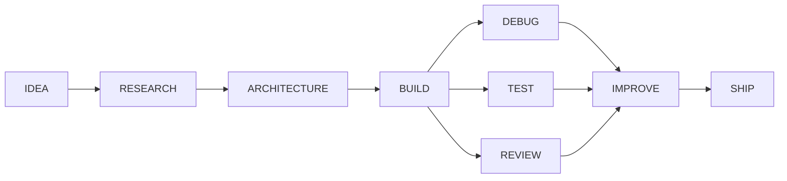

<div align="center">

# `NISANTH.OS`

### Building myself while building things.

<a href="https://github.com/ramnisanth">
  
</a>

<br />

<a href="https://github.com/ramnisanth?tab=repositories"></a>
<a href="#-currently-building"></a>
<a href="mailto:YOUR_EMAIL@example.com"></a>

</div>

---

<details open>
<summary><b>BOOT SEQUENCE</b></summary>

```text
╭──────────────────────────────────────────────────────────────╮
│                                                              │
│                         NISANTH.OS                            │
│                                                              │
│                    INITIALIZING...                           │
│                                                              │
│  identity.................... OK                             │
│  curiosity................... OK                             │
│  projects.................... OK                             │
│  experiments................. OK                             │
│  unfinished ideas............ OK                             │
│                                                              │
│                         WELCOME.                             │
│                                                              │
╰──────────────────────────────────────────────────────────────╯
```

</details>

> An interactive portfolio built as a small digital world. Not another collection of project cards—a place to explore what I am learning, what I am building, how I use AI, and what I am curious about.

<div align="center">

### `SYSTEM STATUS`

| Learning | Building | Exploring | Figuring out |
|:---:|:---:|:---:|:---:|
| `████████████████████` | `█████████████████░░░` | `████████████████░░░░` | `█████████████░░░░░░░` |

</div>

## `00 / NAVIGATION`

<details open>
<summary><b>Open the system map</b></summary>

| Module | Purpose |
|:---|:---|
| [`01 / About`](#-01--about) | The person behind the projects |
| [`02 / Stack`](#-02--stack) | Tools and technologies I am exploring |
| [`03 / Journey`](#-03--journey) | Where the learning path has taken me |
| [`04 / Projects`](#-04--projects) | Selected work and project direction |
| [`05 / AI Lab`](#-05--ai-lab) | How I use AI while building |
| [`06 / Currently Building`](#-06--currently-building) | Current snapshots, not skill ratings |
| [`07 / Beyond Code`](#-07--beyond-code) | Interests outside programming |
| [`08 / Roadmap`](#-08--roadmap) | What comes next |

</details>

## `01 / ABOUT`

I am an **AI-focused student learning software by building things**. I am still early in the process, so I am not trying to present myself as finished. I am documenting the process of figuring things out: the useful ideas, the broken experiments, the technical decisions, and the lessons that survive the next iteration.

My portfolio is also a project. It is a place where I can apply what I am learning about frontend development, backend systems, databases, AI-assisted development, Three.js, animation, interaction design, software architecture, and IoT.

> **I am curious. I build things. I experiment. I am still learning.**

## `02 / STACK`

<p align="center">
  
</p>

| Layer | Responsibility |
|:---|:---|
| **React** | Structure and UI |
| **Three.js** | 3D world and interaction |
| **Anime.js** | Motion and sequencing |
| **CSS** | Layout and visual system |
| **Vite** | Development and build tooling |
| **Java / Backend / SQL** | Systems, APIs, and data |
| **AI tools** | Research, architecture, coding, debugging, and review |

```text
React      → STRUCTURE
Three.js   → WORLD
Anime.js   → MOTION
CSS        → VISUAL DESIGN
AI         → MORE WAYS TO THINK
```

## `03 / JOURNEY`

```text
START
  │
  ▼
PROGRAMMING → OOP → DATABASES → BACKEND → FULL STACK → AI → IoT → ???
                                                                            │
                                                                            ▼
                                                                          NEXT?
```

The last node is intentionally unknown. I do not know exactly where the path ends, and that is part of the point.

## `04 / PROJECTS`

### `STUDYFORGE AI`

> An AI-powered learning and project-management environment for students.

StudyForge AI is an exploration of how frontend, backend, databases, AI workflows, and analytics can work together as one learning system.

```text
┌─────────────┐
│  FRONTEND   │
└──────┬──────┘
       ▼
┌─────────────┐
│   BACKEND   │
└──────┬──────┘
       ▼
┌─────────────┐
│  DATABASE   │
└──────┬──────┘
       ▼
┌─────────────┐
│   AI LAYER  │
└──────┬──────┘
       ▼
┌─────────────┐
│  ANALYTICS  │
└─────────────┘
```

<details>
<summary><b>How I evaluate a project</b></summary>

A project is more than its framework list. I want to understand the **problem**, the **thinking**, the **technology**, where **AI** helped, what **failed**, what I **learned**, and what I would change **next**.

</details>

## `05 / AI LAB`

AI is not a badge on my portfolio. It is part of how I build.



| Role | How AI supports the work |
|:---|:---|
| **Teacher** | Explaining concepts and answering questions while I learn |
| **Architect** | Comparing approaches and thinking through system design |
| **Coding partner** | Generating, explaining, refactoring, and exploring code |
| **Debugger** | Investigating errors and understanding what broke |
| **Reviewer** | Challenging decisions and looking for weaknesses |
| **Researcher** | Exploring technologies and possible solutions |

> **AI does not replace my thinking. It gives me more ways to think through a problem.**

## `06 / CURRENTLY BUILDING`

These are snapshots of where things are right now—not claims of mastery.

| Project | Status | Focus |
|:---|:---:|:---|
| **StudyForge AI** | `████████░░` | AI, backend, database, analytics |
| **Portfolio / NISANTH.OS** | `██████░░░░` | React, Three.js, animation, interaction |
| **AI experiments** | `████░░░░░░` | RAG prototypes and AI-assisted workflows |
| **IoT experiments** | `███░░░░░░░` | Sensors, communication, and physical systems |

## `07 / BEYOND CODE`

There is more to me than a contribution graph. I am also learning guitar, working on discipline through fitness, and staying curious about the world outside a screen.

```text
MY WORLD
├── MUSIC     → Guitar fundamentals
├── FITNESS   → Train → Recover → Repeat
└── LEARNING  → Curiosity → Practice → Growth
```

## `08 / ROADMAP`

```text
[x] Define the NISANTH.OS concept
[x] Design the information architecture
[x] Define the Three.js / Anime.js split
[ ] Build the boot sequence
[ ] Build the Knowledge Core
[ ] Build the hero
[ ] Build the project universe
[ ] Build the skill constellation
[ ] Build the AI lab
[ ] Add project case studies
[ ] Add experiments
[ ] Add responsive fallback
[ ] Optimize performance
[ ] Add portfolio AI
[ ] Connect everything
```

## `09 / PRINCIPLES`

```text
NO fabricated projects
NO fake achievements
NO invented experience
NO meaningless skill percentages
NO animation without a reason
NO dependency for the sake of a dependency
NO giant component that does everything
NO 200,000 particles because they look cool
```

<div align="center">

`READABLE CODE > CLEVER CODE`    `CONTENT > EFFECTS`    `PERFORMANCE > SCREENSHOTS`    `HONESTY > IMPRESSIVE WORDS`

</div>

## `10 / GITHUB ACTIVITY`

<div align="center">
  
  
</div>

<p align="center">
  
</p>

## `11 / CONNECT`

<div align="center">

<a href="https://github.com/ramnisanth"></a>
<a href="mailto:YOUR_EMAIL@example.com"></a>
<a href="YOUR_LINKEDIN_URL"></a>

<br /><br />

<sub>Built while learning. Improved while breaking things.</sub>

</div>

---

<div align="center">

### `NISANTH.OS // STILL BUILDING`

</div>

<!--
SETUP NOTES
1. Create a public repository named exactly: ramnisanth
2. Save this file as README.md in that repository.
3. Replace YOUR_EMAIL@example.com and YOUR_LINKEDIN_URL.
4. Replace the placeholder portfolio link when the site is live.
5. The external animated widgets update automatically; if GitHub rate-limits one, the rest of the README still works.
-->
